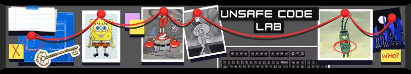

<h1 align=center>Unsafe Code Lab</h1>

<div align=center>
  
</div>

**Unsafe Code Lab** is a hands-on security training ground for code reviewers and penetration testers. Learn to spot vulnerabilities in production-quality code by understanding *why* they happen: refactoring drift, framework design patterns, and subtle API misuse.

## Who This Is For

- **AppSec students** with CTF/bug bounty/pentesting experience who want to master secure code review
- **Developers** learning secure coding practices through realistic examples
- **Senior security engineers** needing quick reference material when reviewing code

## What You'll Find Inside

- **Real code patterns:** See how refactoring and feature additions introduce vulnerabilities
- **Focus on API Design:** See firsthand how framework API design can create security traps
- **Easy Setup:** Execute exploits directly from VSCode using .http files—no Burp or ZAP required

## Two Ways to Learn

### Browse on GitHub (no setup required)

Click through the READMEs to learn vulnerabilities, see code snippets, and read exploitation examples. Start here:

**[Flask Confusion Vulnerabilities](flask-confusion/)** — A progressive curriculum exploring how different parts of an application can "disagree" about the same data:

| Section | What Goes Wrong |
|---------|-----------------|
| [Input Source](flask-confusion/webapp/r01_input_source_confusion/) | Different code paths read from different locations |
| [Authentication](flask-confusion/webapp/r02_authentication_confusion/) | Identity verification vs. identity usage disagree |
| [Authorization](flask-confusion/webapp/r03_authorization_confusion/) | Permission checks vs. actions use different values |
| [Cardinality](flask-confusion/webapp/r04_cardinality_confusion/) | Single value vs. list disagreements |
| [Normalization](flask-confusion/webapp/r05_normalization_issues/) | String transformation inconsistencies |

Each section contains multiple exercises with realistic vulnerable code, interactive `.http` demos, and fixed versions.

### Run Locally (Docker + VSCode)

Clone the repo, start Docker Compose, and execute exploits from `.http` files directly in VSCode.

#### Prerequisites

- [Docker](https://docs.docker.com/get-docker/) (Docker Desktop or Docker Engine with Compose v2)
- [REST Client extension](https://marketplace.visualstudio.com/items?itemName=humao.rest-client) for VS Code

#### Quick Start

```bash
git clone https://github.com/Irench1k/unsafe-code
cd unsafe-code/flask-confusion
docker compose up -d
```

Open any `.http` file in VSCode and click "Send Request" to execute exploits.

- View logs: `docker compose logs -f`
- Stop: `docker compose down`

## Contributing

We welcome contributions! Development happens on the [`develop`](https://github.com/Irench1k/unsafe-code/tree/develop) branch, which contains additional tooling for contributors. See [CONTRIBUTING.md](CONTRIBUTING.md) for how to get started.

## License

This project is licensed under the terms in [LICENSE](LICENSE).
