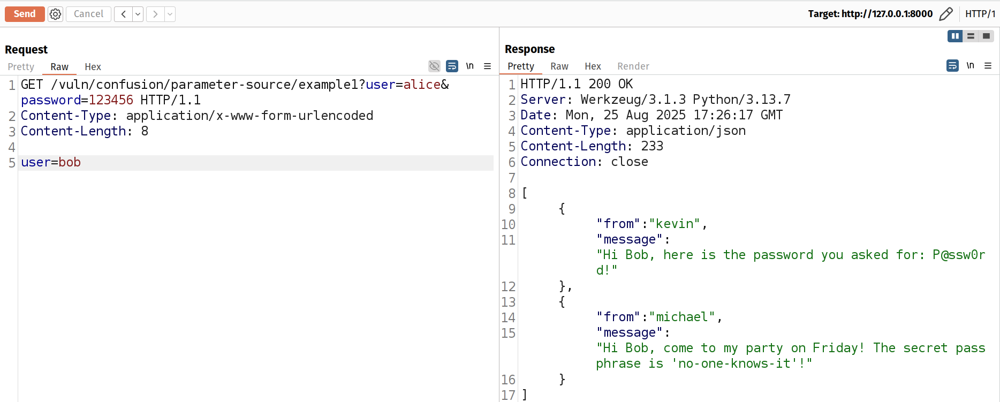

# Parameter Source Confusion Vulnerabilities in Flask

This directory contains examples demonstrating various patterns of parameter source confusion vulnerabilities in Flask applications. These examples show how mixing different parameter sources (query strings, form data, and request.values) can lead to security vulnerabilities.

## Overview

Parameter source confusion occurs when an application retrieves the same parameter from different sources in different parts of the code. This can lead to security vulnerabilities when authentication and data access use different sources for the same parameter.

Here you can find several examples on how Flask framework design allows those vulnerabilities to be present.

## Examples

### Basic Pattern

#### Example 0: Secure Baseline

Here you can see a secure implementation that consistently uses query string parameters for both authentication and data retrieval.

```python
@bp.route("/example0", methods=["GET", "POST"])
def example0():
    # Extract the user name from the query string arguments
    user = request.args.get("user", None)

    # Validate the user name
    password = db["passwords"].get(user, None)
    if password is None or password != request.args.get("password", None):
        return "Invalid user or password", 401

    # Retrieve the messages for the user
    messages = db["messages"].get(user, None)
    if messages is None:
        return "No messages found", 404

    # return the messages
    return messages
```

Request:

```http
GET /vuln/confusion/parameter-source/example0?user=alice&password=123456
```


#### Example 1: Basic Parameter Source Confusion

Demonstrates the most basic form of parameter source confusion where authentication uses **query** parameters but data retrieval uses **form** data.

```python
@bp.route("/example1", methods=["GET", "POST"])
def example1():
    user = request.args.get("user", None)

    password = db["passwords"].get(user, None)
    if password is None or password != request.args.get("password", None):
        return "Invalid user or password", 401

    # Use the POST value which was not validated!
    user = request.form.get("user", None)
    messages = db["messages"].get(user, None)
    if messages is None:
        return "No messages found", 404

    return messages
```

Request:

```http
# Expected Usage
GET /example1?user=alice&password=123456

# Attack
GET /vuln/confusion/parameter-source/example1?user=alice&password=123456 HTTP/1.1
Content-Type: application/x-www-form-urlencoded
Content-Length: 8

user=bob
```

Here you can see if we provide bob's name in the request body, we can access his messages without his password.



### Function-Level Separation

#### Example 2: Function-Level Parameter Source Confusion

Functionally equivalent to example 1, but shows how separating authentication and data retrieval into different functions can make the vulnerability harder to spot.

```python
def authenticate(user, password):
    if password is None or password != db["passwords"].get(user, None):
        return False
    return True


def get_messages(user):
    messages = db["messages"].get(user, None)
    if messages is None:
        return None
    return {"owner": user, "messages": messages}


@bp.route("/example2", methods=["GET", "POST"])
def example2():
    if not authenticate(
        request.args.get("user", None), request.args.get("password", None)
    ):
        return "Invalid user or password", 401

    messages = get_messages(request.form.get("user", None))
    if messages is None:
        return "No messages found", 404

    return messages
```

### Cross-Module Separation

#### Example 3: Cross-Module Parameter Source Confusion

Demonstrates how the vulnerability becomes more subtle when authentication logic is moved to a separate module.

Example 3 is functionaly equivalent to examples 1 and 2.

```python
def authenticate_user():
    """Authenticate the user, based solely on the request query string."""
    return authenticate(
        request.args.get("user", None), request.args.get("password", None)
    )


@bp.route("/example3", methods=["GET", "POST"])
def example3():
    if not authenticate_user():
        return "Invalid user or password", 401

    messages = get_messages(request.form.get("user", None))
    if messages is None:
        return "No messages found", 404

    return messages
```

##### Problem

The examples 1-3 are realistic and some are hard to detect, but there are still two issues with it:

1. The situation is unlikely to occur in exactly this way, because here
   the request doesn't work at all if the `user` gets passed only via the query string (it HAS to pass two `user` values, through query string and the body argument).
2. The second issue is that while calling verification function explicitly is valid, a more common pattern is either using a decorator or a middleware.


Let's see how we can resolve those issues.

### Helper Function Patterns

#### Example 4: Form-Query Priority Resolution

Shows how a helper function that implements source prioritization can create vulnerabilities.

In Example 4 we don't need to specify body parameters to get a result (which is now more realistic!), but if we want, we can still access bob's messages by passing his user name in the request body:

```python
def get_user():
    user_from_form = request.form.get("user", None)
    user_from_args = request.args.get("user", None)

    return user_from_form or user_from_args


@bp.route("/example4", methods=["GET", "POST"])
def example4():
    if not authenticate_user():
        return "Invalid user or password", 401

    messages = get_messages(get_user())
    if messages is None:
        return "No messages found", 404
    return messages
```

Request:

```http
GET /vuln/confusion/parameter-source/example4?user=alice&password=123456 HTTP/1.1
Content-Type: application/x-www-form-urlencoded
Content-Length: 8

user=bob
```

### Request.Values Usage

#### Example 5: Form Authentication Bypass

Demonstrates how using request.values can allow query parameters to override form data.

Here the expected behaviour would be passing user and password data in the request body, but we can still access bob's messages once we pass his user name in the request query.

```python
def authenticate_user_example5():
    """Authenticate the user, based solely on the request body."""
    return authenticate(
        request.form.get("user", None), request.form.get("password", None)
    )


@bp.route("/example5", methods=["GET", "POST"])
def example5():
    if not authenticate_user_example5():
        return "Invalid user or password", 401

    # The vulnerability occurs because flask's request.values merges the form and query string
    messages = get_messages(request.values.get("user", None))
    if messages is None:
        return "No messages found", 404

    return messages
```

Request:

```http
# Expected Usage
POST /vuln/confusion/parameter-source/example5? HTTP/1.1
Content-Type: application/x-www-form-urlencoded
Content-Length: 26

user=alice&password=123456
```


```
# Attack
POST /vuln/confusion/parameter-source/example5?user=bob HTTP/1.1
Content-Type: application/x-www-form-urlencoded
Content-Length: 26

user=alice&password=123456
```


### Mixed Source Authentication

#### Example 6: Mixed-Source Authentication

Shows how authentication and data access can use different combinations of sources.

This one is interesting, because you can access Bob's messages by providing his username and Alice's password in the request query, while providing Alice's username in the request body:

```python
def authenticate_user_example6():
    """Authenticate the user, based solely on the request query string."""
    user = get_user()
    password = request.args.get("password", None)
    return authenticate(user, password)


@bp.route("/example6", methods=["GET", "POST"])
def example6():
    if not authenticate_user_example6():
        return "Invalid user or password", 401

    messages = get_messages(request.args.get("user", None))
    if messages is None:
        return "No messages found", 404
    return messages
```

Request:

```http
GET /vuln/confusion/parameter-source/example6?user=bob&password=123456 HTTP/1.1
Content-Type: application/x-www-form-urlencoded
Content-Length: 10

user=alice
```


#### Example 7: Request.Values in Authentication

Demonstrates how using request.values in authentication while using form data for access creates vulnerabilities.

This is an example of a varient of example 5, as we do the similar thing, but now we can pass Bob's username in the request body with Alice's password, while passing Alice's username in the request query:

```python
def authenticate_user_example7():
    """Authenticate the user, based solely on the request body."""
    return authenticate(
        request.values.get("user", None), request.values.get("password", None)
    )


@bp.route("/example7", methods=["GET", "POST"])
def example7():
    if not authenticate_user_example7():
        return "Invalid user or password", 401

    messages = get_messages(request.form.get("user", None))
    if messages is None:
        return "No messages found", 404

    return messages
```

Request:

```http
POST /vuln/confusion/parameter-source/example7?user=alice HTTP/1.1
Content-Type: application/x-www-form-urlencoded
Content-Length: 24

user=bob&password=123456
```


### Framework Features

#### Example 8: Decorator-based Authentication

Shows how using decorators can obscure parameter source confusion.

Example 8 is functionally equivalent to Example 4, but it may be harder to spot the vulnerability while using decorators.

```python
def authentication_required(f):
    @wraps(f)
    def decorated_example8(*args, **kwargs):
        if not authenticate_user():
            return "Invalid user or password", 401
        return f(*args, **kwargs)

    return decorated_example8


@bp.route("/example8", methods=["GET", "POST"])
@authentication_required
def example8():
    messages = get_messages(get_user())
    if messages is None:
        return "No messages found", 404
    return messages
```

Request:

```http
GET /vuln/confusion/parameter-source/example4?user=alice&password=123456 HTTP/1.1
Content-Type: application/x-www-form-urlencoded
Content-Length: 8

user=bob
```

#### Example 9: Middleware-based Authentication

Demonstrates how Flask's middleware system can contribute to parameter source confusion.

Example 9 is functionally equivalent to Example 4, but it may be harder to spot the vulnerability while using middleware.

Code for Example 9 can be found in `confusion/parameter_source middleware_example.py`

```http
GET /vuln/confusion/parameter-source/example4?user=alice&password=123456 HTTP/1.1
Content-Type: application/x-www-form-urlencoded
Content-Length: 8

user=bob
```

## Vulnerability Patterns

1. **Direct Source Confusion**

   - Authentication uses one source
   - Data retrieval uses another source
   - Examples: 1, 2, 3

2. **Helper Function Confusion**

   - Helper functions that mix sources
   - Priority-based source resolution
   - Examples: 4

3. **Request.Values Confusion**

   - Using request.values which merges sources
   - Query parameters can override form data
   - Examples: 5, 7

4. **Framework Feature Confusion**
   - Decorators and middleware hiding source confusion
   - Architectural patterns making vulnerabilities harder to spot
   - Examples: 8, 9

## Security Implications

These vulnerabilities can lead to:

- Authentication bypasses
- Privilege escalation
- Unauthorized data access
- Business logic bypasses

## Running the Examples

You can see the examples implementation in

```sh
flask/blueprint/webapp/vuln/confusion/parameter_source/routes.py
```

## Warning

These examples are for educational purposes only. They demonstrate security vulnerabilities that should NOT be present in production code.
